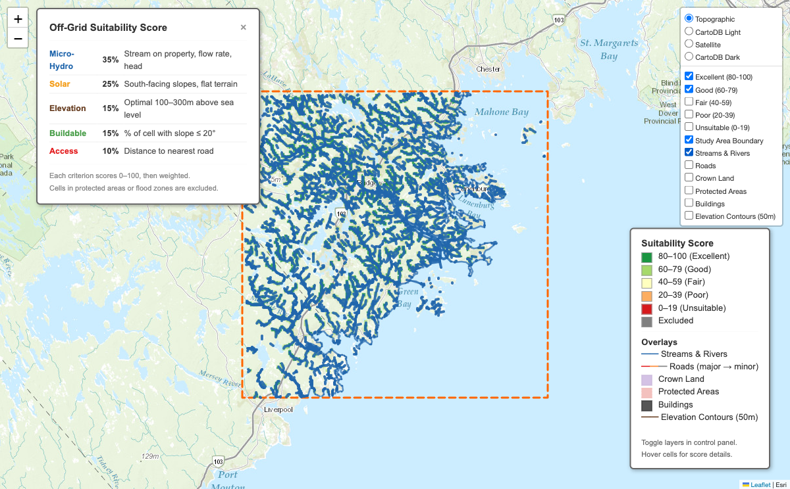
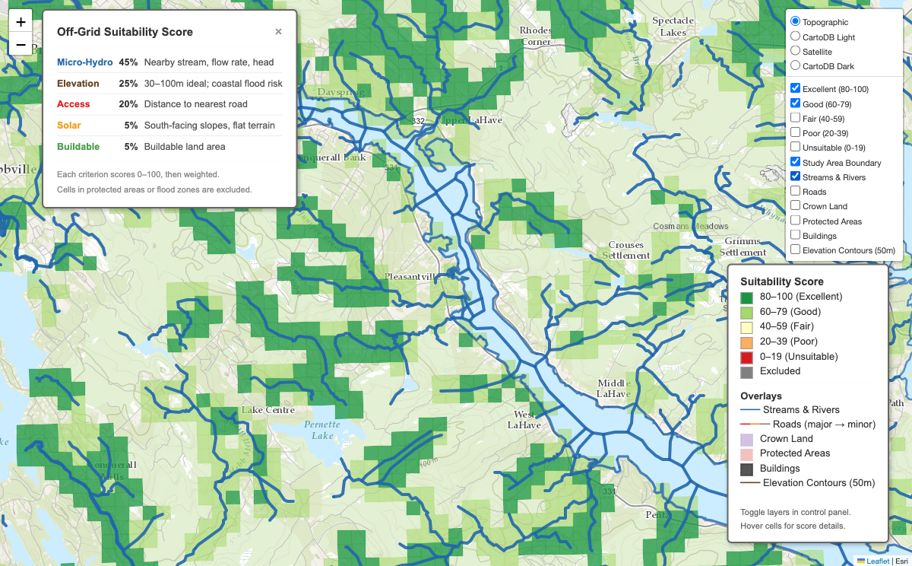

# Off-Grid Property Finder

Rank Nova Scotia land for off-grid living suitability using geospatial analysis.

Generates a 250m candidate grid over a configurable study area, scores each cell across five criteria (micro-hydro potential, elevation safety, road access, solar exposure, and buildable area), and produces ranked output as CSV, GeoJSON, and an interactive Folium map.

Built for screening rural Nova Scotia land — particularly the south shore near Lunenburg — for residential off-grid potential with an emphasis on micro-hydro power.





## How It Works

```
Raw GIS Data → Ingest & Reproject → DEM Derivatives → Masks → 250m Grid
    → Score (5 criteria) → Exclusions → Confidence → Rank → Export + Map
```

1. **Ingest** raw data (DEM, streams, roads, land cover, buildings) into standardized formats
2. **Prepare** DEM derivatives (slope, aspect, flow accumulation) and build eligibility masks
3. **Score** each 250m cell on five weighted criteria
4. **Exclude** cells in protected areas or flood zones
5. **Export** ranked results as CSV, GeoJSON, GeoPackage, and an interactive HTML map

## Quick Start

```sh
# Create venv and install
python3.12 -m venv .venv
source .venv/bin/activate
pip install -e ".[dev]"

# Place raw GIS data in data/raw/ (see Data section below)

# Run the pipeline
python -m src prepare   # Ingest, clip, generate DEM derivatives, build grid
python -m src score     # Score cells, compute confidence, rank, export
python -m src visualize # Generate interactive map
```

## Scoring Criteria

Each eligible cell receives a weighted composite score (0-100):

| Criterion | Weight | What it measures |
|-----------|--------|------------------|
| **Hydro** | 45% | Micro-hydro power potential from nearby streams (head x flow x efficiency) |
| **Elevation** | 25% | Coastal flood resilience — sweet spot is 30-100m ASL for NS |
| **Access** | 20% | Distance to nearest road or civic address (not legal access) |
| **Solar** | 5% | South-facing slope suitability for ground-mounted solar |
| **Buildable** | 5% | Percentage of cell with slope <=20 degrees (usable for structures) |

Hydro dominates because it's the primary differentiator — solar works almost everywhere in NS, but micro-hydro potential varies dramatically by location. Weights are configurable in `config.yaml` and auto-renormalize when criteria are disabled.

### Hard Exclusions

Cells are excluded (`score = null`) when:
- Centroid falls inside a mapped protected area, **or**
- Excluded-area overlap exceeds 50% of cell area (configurable)
- Same logic applies for flood zones

Excluded cells are still emitted in output with `status = excluded` and explicit `exclusion_reasons`.

### Confidence Scoring

Each cell gets a confidence score (0-100) and band (high/medium/low). Starts at 100, with deductions for:
- Missing flood data (-20)
- Hydro uses drainage proxy only (-20)
- DEM is 20m resolution, not LiDAR (-15)
- Incomplete land-cover mask (-10)
- No road evidence within 200m (-15)

## CLI Commands

```sh
python -m src --help          # Show all commands
python -m src check-data      # Verify raw data files are present and readable
python -m src ingest          # Convert raw -> processed formats
python -m src prepare         # Full data preparation pipeline
python -m src score           # Score, rank, and export results
python -m src visualize       # Generate interactive Folium map
python -m src analyze         # Print score distribution statistics
```

Options: `--config path/to/config.yaml`, `--log-level DEBUG|INFO|WARNING|ERROR`

## Configuration

Edit `config.yaml` to customize:

- **study_area**: Bounding box (EPSG:2961) and name
- **cell_size_m**: Grid cell size (default: 250m)
- **weights**: Scoring weights per criterion (auto-renormalized)
- **enabled_criteria**: Which criteria to include
- **confidence_deductions**: Penalty values for data quality gaps
- **exclusion_overlap_threshold**: Fraction of cell area triggering exclusion (default: 0.5)

## Data

Place raw data in `data/raw/` subdirectories:

| Directory | Dataset | Source | Required? |
|-----------|---------|--------|-----------|
| `dem/` | DEM raster (GeoTIFF) | [CDEM](https://ftp.maps.canada.ca/pub/nrcan_rncan/elevation/cdem_mnec/) or [HRDEM](https://open.canada.ca/data/en/dataset/957782bf-847c-4644-a757-e383c0057995) | Yes |
| `hydro/` | Stream network (GDB/Shapefile) | [NSHN](https://data.novascotia.ca/datasets/dk27-q8k2) | Yes |
| `roads/` | Road network (OSM PBF) | [Geofabrik](https://download.geofabrik.de/north-america/canada/nova-scotia-latest.osm.pbf) | Yes |
| `buildings/` | Building footprints (GPKG) | [NRCan](https://open.canada.ca/data/en/dataset/7a5cda52-c7df-427f-9ced-26f19a8a64d6) | Yes |
| `land-cover/` | Land cover polygons (Shapefile) | [NSTDB](https://nsgi.novascotia.ca/WSF_DDS/DDS.svc/DownloadFile?tkey=fhrTtdnDvfytwLz6&id=13) | Yes |
| `exclusions/` | Protected areas, flood zones | [GeoNova](https://geonova.novascotia.ca/geodata/) | Recommended |
| `crown-land/` | Crown land parcels (Shapefile) | [NS Open Data](https://data.novascotia.ca/Lands-Forests-and-Wildlife/Crown-Land/3nka-59nz) | Optional |
| `parcels/` | Property parcels (Shapefile) | NSGI (account required) | Stage B only |

Raw data files are not committed to the repo. The processed files in `data/processed/` contain everything the pipeline needs for scoring. To re-ingest from scratch (e.g., to change the study area), re-download the raw files from the links above and run `python -m src prepare`.

See [DATA-SOURCES.md](DATA-SOURCES.md) for the full data source inventory.

### Format Conversion

The `ingest` command handles format conversion automatically:
- OSM PBF -> filtered road GPKG
- NSHN File Geodatabase -> stream line GPKG
- DEM reprojection (any CRS -> EPSG:2961) and clipping
- Compound CRS handling (NAD83(CSRS)v6 + CGVD2013)

## Output

All output goes to `output/`:

| File | Description |
|------|-------------|
| `scored_cells.gpkg` | Full results with geometry (GeoPackage) |
| `scored_cells.csv` | All cells with lat/lon, scores, confidence |
| `scored_cells.geojson` | GeoJSON in WGS84 for web mapping |
| `ranked_eligible.csv` | Eligible cells only, sorted by rank |
| `map.html` | Interactive Folium map with color-coded cells |

Each record includes: `score`, `status`, `exclusion_reasons`, `confidence_score`, `confidence_band`, and `flags`.

## Project Structure

```
src/
├── cli.py              # Click CLI with subcommands
├── config.py           # YAML config loading and validation
├── constants.py        # Threshold tables, weights, flags
├── ingest.py           # Raw data ingestion (format conversion)
├── prepare.py          # Data preparation orchestrator
├── score.py            # Scoring pipeline orchestrator
├── export.py           # CSV/GeoJSON export
├── visualize.py        # Folium map generation
├── grid.py             # Candidate grid generation
├── dem.py              # DEM derivative generation (slope, aspect, flow)
├── mask.py             # Rural-eligibility and buildability masks
├── exclusions.py       # Exclusion layer loading and application
├── clip.py             # Raster/vector clipping
├── crs.py              # CRS utilities
├── check_data.py       # Data validation
├── analyze.py          # Score distribution analysis
├── logging_config.py   # Logging setup
└── scoring/            # Pluggable scorer registry
    ├── registry.py     # Scorer registration + weighted composite
    ├── hydro.py        # Micro-hydro power estimation
    ├── solar.py        # Solar suitability scoring
    ├── elevation.py    # Elevation scoring
    ├── access.py       # Road/civic address proximity
    ├── buildable.py    # Buildable area percentage
    ├── confidence.py   # Confidence scoring and banding
    └── preferences.py  # Parcel aggregation (Stage B)
tests/
├── conftest.py         # Synthetic test fixtures
├── test_config.py      # Config loading and validation
├── test_cli.py         # CLI command tests
├── test_grid.py        # Grid generation and filtering
├── test_exclusions.py  # Exclusion logic
├── test_export.py      # CSV/GeoJSON export
├── test_scoring_*.py   # Per-scorer unit tests (7 files)
├── test_analyze.py     # Score distribution analysis tests
└── test_integration.py # End-to-end pipeline test
```

## Development

```sh
source .venv/bin/activate
pytest                    # Run all 92 tests
pytest -v                 # Verbose output
pytest tests/test_grid.py # Run specific test file
```

## Technical Details

- **CRS**: All processing uses EPSG:2961 (NAD83(CSRS) UTM Zone 20N). Raw data in other CRS is automatically reprojected during ingestion.
- **Grid**: Fixed 250m x 250m square cells. Cells are filtered by rural-eligibility mask but never clipped — they remain fixed squares.
- **Hydro methodology**: Based on Cyr et al. (2011) methodology for NB small hydro assessment. Uses conservative low-flow proxy (8 L/s/km2) calibrated from HYDAT station data for southern NS.
- **Raster compression**: All processed rasters use LZW compression (lossless) to minimize disk usage.
- **Stack**: Python 3.12, GeoPandas, Rasterio, WhiteboxTools, Shapely, Folium, Click

## Roadmap

- **Stage A (current)**: Candidate-cell scoring MVP — complete and functional
- **Stage B**: Parcel-aware pipeline — join cell scores to authoritative property parcels
- **Calibration**: Validate scores against known sites, tune thresholds
- **Future**: HYDAT-based flow regression, LiDAR refinement, web dashboard, multi-province support

## Documentation

- [SPEC.md](SPEC.md) — Full technical specification, scoring methodology, and risk register
- [DATA-SOURCES.md](DATA-SOURCES.md) — Complete data source inventory with URLs
- [IMPLEMENTATION-BACKLOG.md](IMPLEMENTATION-BACKLOG.md) — Task breakdown and milestone plan

## License

[MIT](LICENSE)

## References

- Cyr, J.-F., Landry, M., & Gagnon, Y. (2011). Methodology for the large-scale assessment of small hydroelectric potential: Application to the Province of New Brunswick (Canada). *Renewable Energy*, 36(11), 2940-2950.
